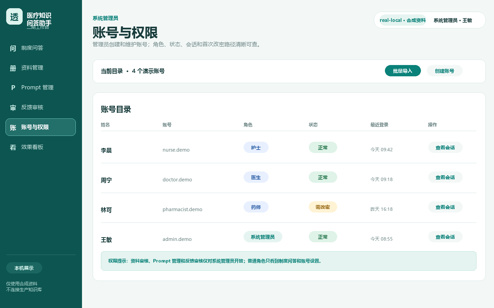
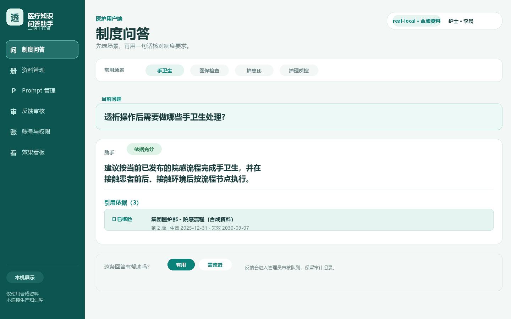
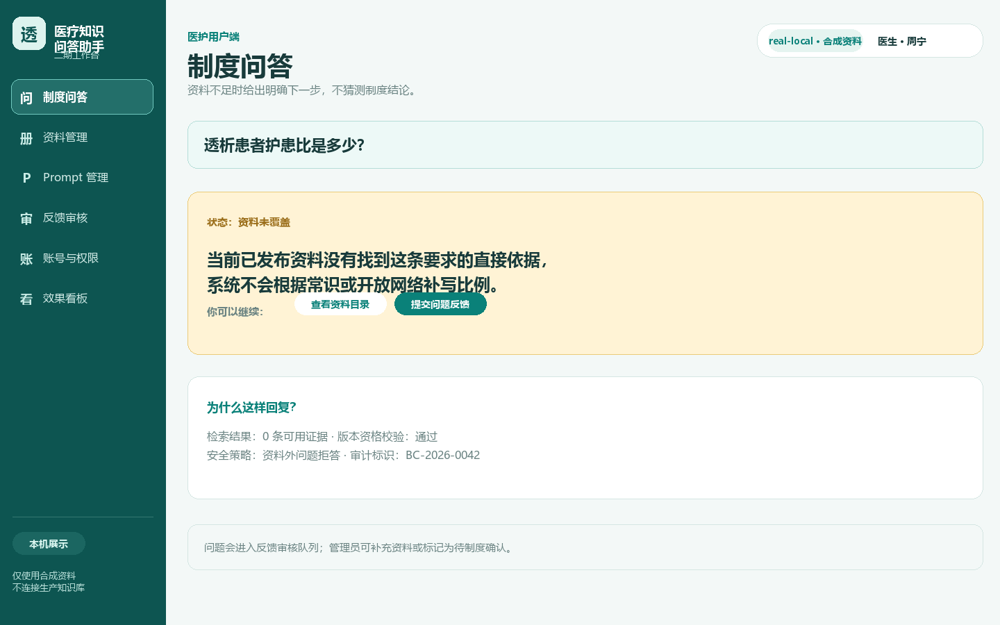
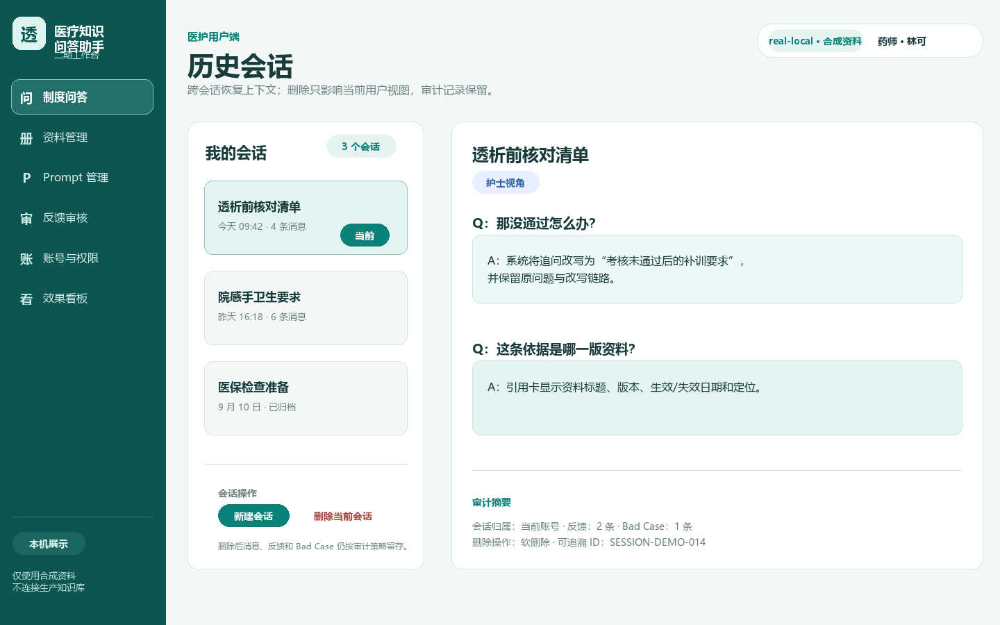
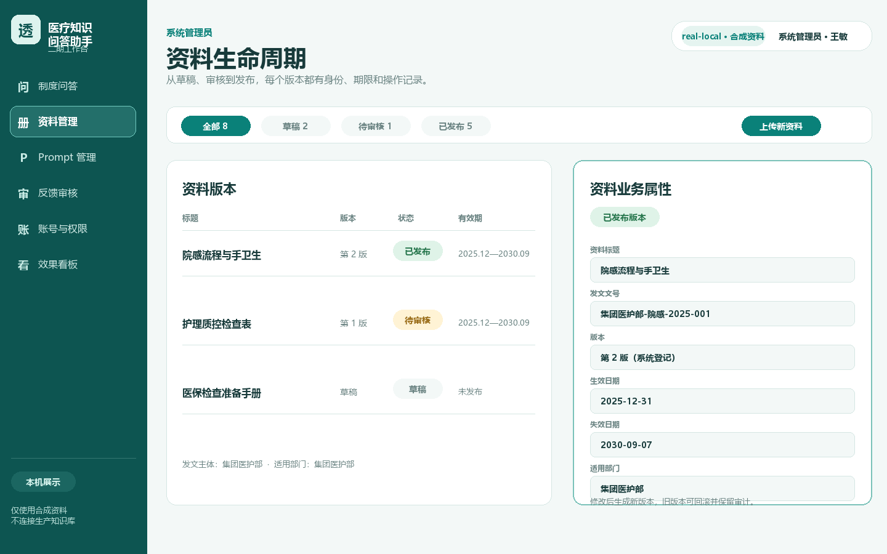
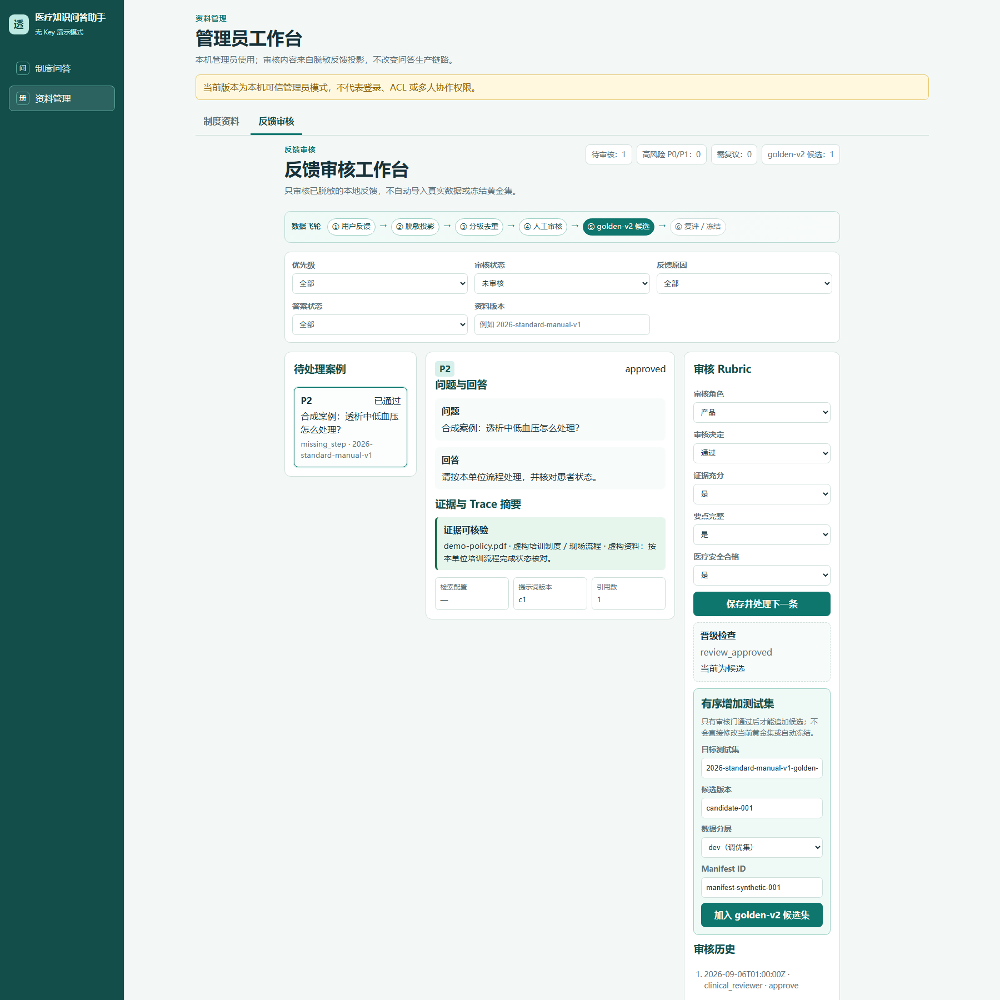
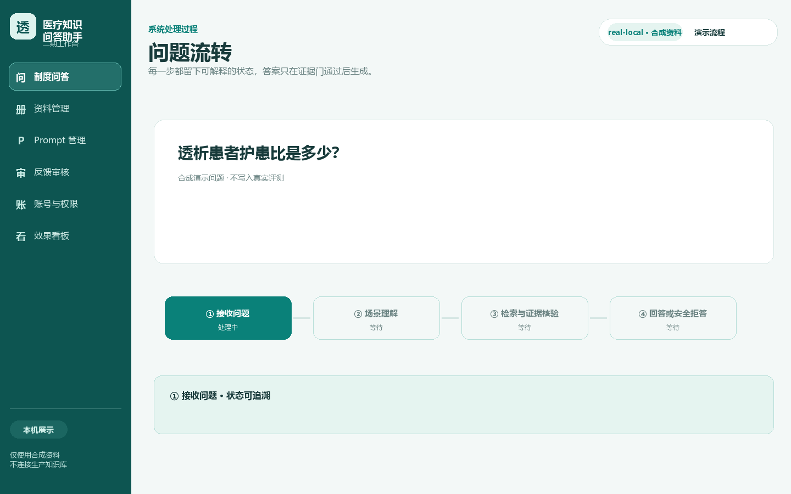

# Demo 指南

本指南用于三分钟本机演示。所有问题和资料均为公开虚构内容；演示不需要 API Key、不访问外网，也不提供医疗建议。

## 演示前准备

在项目根目录完成 Python 3.12 虚拟环境、后端依赖和前端依赖安装，具体命令见 [README 快速体验](../README.md#快速体验)。Windows 推荐直接运行：

```powershell
powershell -ExecutionPolicy Bypass -File scripts\start_demo.ps1
```

脚本会重新生成四个虚构资料的 PDF/DOCX 对，启动绑定本机地址的 FastAPI 和 Vite 开发服务器，并把 SQLite、Qdrant Local 与 PID 记录放在忽略的 `data/runtime/demo/` 下。它不会读取操作员 Cloud Key。

无浏览器冒烟可以单独运行：

```powershell
backend\.venv\Scripts\python.exe scripts\demo_smoke.py --no-network
```

期望的安全摘要是：

```text
indexed_documents=8 answered_questions=2 refused_questions=1 network_calls=0
```

## 视觉素材预览

这些图片和短 GIF 都由本机 Demo 或合成管理员 fixture 捕获。聊天/资料素材使用 `1440×900` 视口；反馈审核截图使用 `1800×1800` 视口。内容只来自虚构资料和合成反馈，不含真实问题、回答或制度正文。可在[媒体清单](assets/manifest.json)中核对文件哈希、尺寸和审核状态。















## 三分钟现场顺序

### 0:00–0:30：先讲边界

先展示 [无 Key 演示模式截图](assets/runtime-mode.png)，指出页面左侧的“医疗知识问答助手”和“无 Key 演示模式”。说明这是本机作品集，资料为虚构培训示例，不是公网系统、诊疗助手或真实机构制度。

### 0:30–1:15：展示一个有引用的回答

在“制度问答”输入：

```text
新员工独立值班前需要完成多少学时岗前培训？
```

可配合 [问题流转 GIF](assets/question-flow.gif) 讲解接受、检索、重排、生成和核验。答案应说明“8 学时”，并显示来自培训资料的可定位引用；[有引用的答案截图](assets/chat-answer.png)展示最终状态。强调页面只在答案结构和引用通过后显示正式答案。

### 1:15–1:45：展示上下文追问

在同一会话输入，并展示[历史恢复截图](assets/chat-history.png)：

```text
那没通过怎么办？
```

Demo Provider 只把这条登记追问映射到独立问题“新员工岗前培训考核未通过后如何处理？”，答案是“7 日内完成补训”。这展示了会话历史和追问改写；不是开放域语义推理的承诺。

### 1:45–2:15：展示拒答边界

输入：

```text
血液透析费用报销比例是多少？
```

公开资料没有这个答案，页面应显示依据不足的拒答（见[拒答截图](assets/chat-refusal.png)），不显示正式答案或伪造引用。说明“拒答”是安全行为，不能用一个看似合理的常识补齐资料空白。

### 2:15–2:45：展示资料和历史

打开“资料管理”，确认列表只有四个虚构资料的 PDF/DOCX 文件和安全状态（见[资料管理截图](assets/documents.png)）。返回历史会话，恢复刚才的对话；说明 SQLite 保存的是版本、消息、引用和反馈元数据，Qdrant Local 保存向量。

如果要讲“上线后如何持续改进”，补充展示[反馈审核与数据飞轮截图](assets/feedback-review.png)：案例先经过脱敏投影、分级去重、人工 Rubric 和证据 Trace，审核通过后才可以按目标集、候选版本和 `dev/holdout` 分层追加到 `golden-v2` 候选历史；它不会直接修改当前黄金集，也不会自动冻结。该图为合成 fixture，默认无 Key Demo 不读取真实反馈。

### 2:45–3:00：用架构收尾

用 [系统架构说明](architecture.md) 的数据流总结：解析 → Chunk → Embedding → Qdrant Local → recall 20 → rerank 6 → `0.35` 门 → Demo/Cloud 模型 → JSON/引用核验 → SSE。最后说明 Cloud 是 BYOK 的显式模式，当前产品运行时仍是单一 RAG 编排。

## 推荐补充问题

这些问题都来自 `demo/questions.json`，可用于展示不同场景：

| 场景 | 问题 | 预期 |
| --- | --- | --- |
| 事实 | 新员工独立值班前需要完成多少学时岗前培训？ | 回答 8 学时并带引用 |
| 流程 | 透析开始前需要完成哪些身份核对和设备检查？ | 回答两个标识、双人核对、自检和报警测试 |
| 条件 | 岗前培训达到什么条件才可以独立值班？ | 回答培训、出勤率和考核门槛 |
| 禁止事项 | 设备自检可以跳过吗？ | 明确不能跳过 |
| 跨资料概括 | 如何同时满足岗前培训和年度学习积分要求？ | 综合两份制度资料 |
| 无答案 | 血液透析费用报销比例是多少？ | 安全拒答、无引用 |
| 追问 | 那没通过怎么办？ | 在已有会话中回答 7 日内补训 |

## Cloud 模式说明

只有在需要展示真实 Provider 连通性时才使用 Cloud：复制 `.env.example` 为本机 `.env`，显式改为 Cloud 并填写自己的 DeepSeek/SiliconFlow Key，然后运行 `scripts\start_cloud.ps1`。启动器只打印 `configured`/`missing` 状态；缺少必需 Key 时 fail closed，不自动回到 Demo。

Task 10 的真实 Cloud smoke 是独立授权点：最多 5 个公开虚构问题、零自动重试、不保存 Provider 原始响应，不把它当成私有 30 题评测。未获得授权前不要为了演示调用外部 Provider。

## 常见故障排查

| 现象 | 检查 | 处理 |
| --- | --- | --- |
| 启动器提示虚拟环境缺失 | `backend\.venv` 是否已创建 | 按 README 安装 Python 环境和依赖 |
| 页面打不开 | 8000/5173 是否被占用 | 停止旧的 launcher，再换端口前先更新脚本和配置；不要杀无关进程 |
| Demo 扫描不是 8 个文件 | `demo/documents` 是否完整 | 重新运行 `scripts\build_demo_documents.py`，确认只存在四个 PDF/DOCX 对 |
| Demo health 不是 `demo` | 是否使用了 Cloud 进程或旧环境变量 | 先运行 `scripts\stop_local.ps1`，再重新启动 Demo |
| Cloud 启动提示配置缺失 | 本机 `.env` 是否显式 Cloud 且两家 Provider 均有自备 Key | 只补齐自己的配置；不要把 Key 写进仓库或发给维护者 |
| 冒烟报告网络调用不为 0 | 运行命令是否包含 `--no-network` | 停止并调查，不把异常结果当作 Demo 通过 |

停止本机启动器：

```powershell
powershell -ExecutionPolicy Bypass -File scripts\stop_local.ps1
```

停止脚本只会在 PID、可执行路径、命令行标记和启动时间全部匹配时停止启动器拥有的进程；无法证明归属时会跳过，避免 PID 重用误杀无关进程。

## 演示后检查

确认页面和终端没有 Provider 原文、Key、本机绝对路径或真实资料；确认 `data/runtime/` 不被 `git status` 纳入；确认没有在浏览器 localStorage 之外保存凭据。若要准备公开副本，先阅读 [安全边界](../SECURITY.md) 和 [路线图](../ROADMAP.md)，再执行独立导出与发布门检查。
