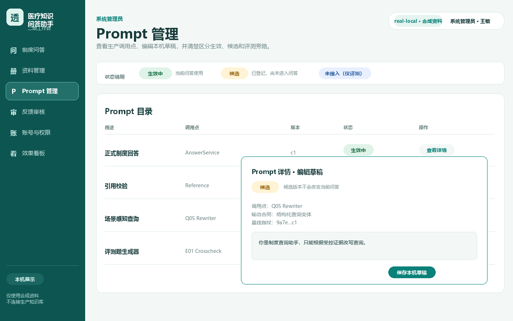
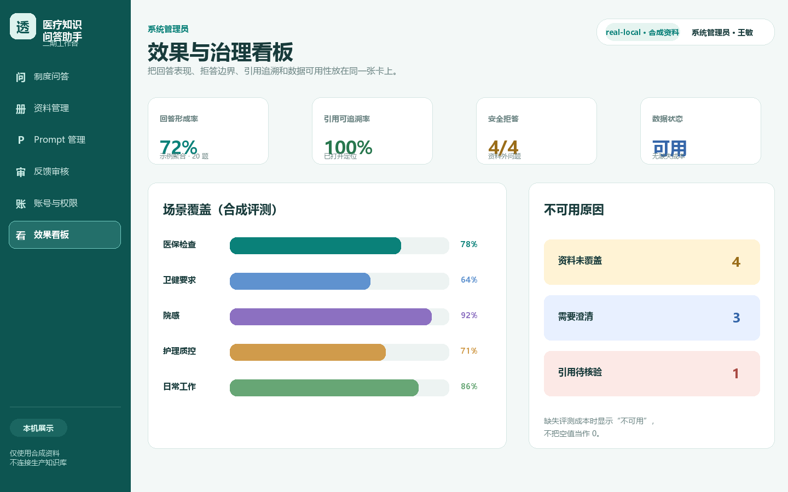

# 二期交付：从可运行 Demo 到可审计的医护工作台

二期围绕一个实际问题展开：医护人员不会逐条阅读制度，但会在工作和检查时快速核对“应该怎么做、适用谁、依据是哪一版”。因此二期把重点从单纯问答扩展到资料生命周期、Prompt 管理、角色隔离、反馈闭环和可验证交付。

这份说明面向招聘方和技术评审者。公开仓库只展示虚构资料、合成交互和脱敏工程指标；真实制度、真实问答、运行库和私有评测仍留在本机私有环境。

## 二期交付范围

| 能力 | 用户看到的结果 | 工程处理 |
| --- | --- | --- |
| 医护问答 | 输入工作问题，得到可核对答案、引用或明确拒答 | 检索、重排、证据门、结构化回答和引用校验分层 |
| 资料治理 | 资料先草稿，再审核、批准和版本化 | 标题、文号、发文主体、适用部门、生效/失效日期和版本指纹受控 |
| Prompt 管理 | 管理员能查看、编辑、对照、发布和回滚 Prompt | 草稿不影响运行时；候选必须绑定评测、模型、预算和回滚目标 |
| 角色与会话 | 护士、医生、药师和管理员看到不同入口；用户可恢复或删除历史会话 | 后端权限校验、会话归属、CSRF、软删除和审计保留分开处理 |
| 反馈闭环 | “有用/无用”反馈进入管理员审核和 Bad Case 数据飞轮 | 脱敏、分级、去重、证据核验、Rubric 和 `golden-v2` 候选晋级均需显式审核 |
| 效果看板 | 管理员查看回答、失败、调用和成本的聚合状态 | 零分母、裁判失败、协议不兼容和成本缺失均保持不可用语义 |
| 场景感知检索 | 对“透析后要不要洗手”“护患比是多少”等问法保留场景条件 | 结构化检索在 real-local 隔离运行中显式启用，公开默认仍关闭 |

## 截图与演示入口

以下图片是二期工作台的公开展示版界面，使用二期信息架构和合成资料；截图本身不含真实制度、患者信息或 Provider 原始响应。公开无 Key Demo 仍以 v1 基线运行，二期界面用于展示产品闭环和治理设计。

### 问答与证据


### 管理与反馈






推荐现场顺序：先运行[Demo 指南](demo-guide.md)，再看[系统架构](architecture.md)，最后阅读[评测与回滚](evaluation.md)和本页的问题处理记录。

## 遇到的问题与处理思路

### 1. “有资料”不等于“能安全回答”

早期链路容易把召回到片段误认为已有答案，或者在没有依据时给出看似合理的常识。处理方式是把检索命中、证据资格、回答结构和引用有效性拆成独立阶段：任何一层失败都返回有限 reason code；资料外的常见工作问题可以给单独标记的通用参考，但不会冒充集团制度答案。

### 2. 常见问法需要一点理解力，但不能放开医学边界

“手消毒怎么做”“透析中低血糖怎么办”“护患比是多少”可能缺少场景、机构类型或时间条件。系统先保留原问题，再生成确定性的同义词和场景约束；缺关键条件时澄清，命中受控参考时分栏呈现。这样改善可用性，同时保留无证据拒答。

### 3. Enter 键、历史会话和删除语义不符合使用习惯

问答输入框改为 Enter 默认发送、Shift+Enter 换行；历史会话支持恢复和软删除。用户删除只影响自己的可见会话和消息，Bad Case 与审核事件保留在独立审计链中，避免为了清理界面而破坏问题追踪。

### 4. 管理员看不清 Prompt 和资料属性

透明弹窗、英文状态和把属性表单塞在页面底部都会增加误操作。处理方式是使用不透明弹窗、中文状态映射、固定滚动区域和分段表单；资料属性先保存为草稿，缺少明确失效日期时禁止进入正式问答。

### 5. 版本字段不能只显示一个没有含义的数字

版本现在绑定资料正文/元数据指纹和业务修订语义；文号自动生成并作为唯一标识，资料标题从原始材料提取，发文主体和适用部门在首批范围内统一为集团医护部。内容或有效属性变化时才递增，单纯重新审核不会制造假版本。

### 6. 召回指标提升，回答体验反而变差

Hybrid/RRF 对照曾提高召回指标，但回答可用率、引用有效率和时延出现回退。处理方式是固定题集、资料快照、模型、Prompt 和预算，保留 vector 基线作为默认，候选检索保持显式关闭；不因为一个指标变好就切换生产组合。

### 7. Provider、JSON 和预算问题不能靠无限重试掩盖

候选生成和在线评测曾出现传输失败、JSON 截断和严格结构解析失败。运行器因此采用固定 Provider、物理调用预算、0 自动重试、有限错误分类和私有聚合输出；失败发生在输入预检或 Provider 前时，直接记录阻断原因，不伪造实验结果。

### 8. QA10 和 Q04 的输入不完整

QA10 需要真实现状事实，Q04 需要每条评测记录的来源映射。缺失时只生成流程夹具或输入预检报告，保留 `missing/unknown` 和 `source_refs` 缺口，转入三期 P3-Q02/P3-Q01；合成数据永远不会被写成真实质量通过。

## 二期最终验收口径

二期已按 `real-local local_demo` 和求职展示范围收口。自动化回归、Ruff、治理检查和 real-local 浏览器走查作为该范围的最终测试结果；UAT 使用 AI 双验等效路径，人工反馈作为后验纠错入口。该结论用于作品集展示，不代表临床部署、真实用户研究、医疗决策能力或外部发布批准。

公开 Demo 的验证命令：

```powershell
backend\.venv\Scripts\python.exe scripts\demo_smoke.py --no-network
backend\.venv\Scripts\python.exe scripts\validate_public_release.py --history
```

真实资料和评测不随公开仓库发布。二期私有 real-local 评测曾记录 80 题冻结工程基线、资料版本、引用和拒答等聚合事实，但逐题问题、回答、制度正文、运行库和 Provider 响应均不在此仓库。

## 三期承接

三期首先处理三件事：真实资料和事实治理、Prompt 运行时晋级/回滚、Q04 M2 输入合同修复与受控实验。多查询、真实 QA10、移动端和更大范围试点均保持默认关闭，直到各自的输入、预算、回滚和验收门完整。

详细背景见[项目案例](project-case-study.md)、[作品集导览](portfolio-brief.md)和[发布证据与远程发布门](release-evidence.md)。

